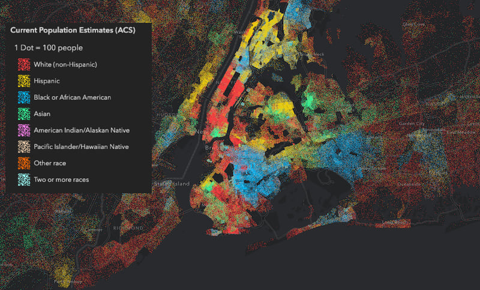

El objetivo de esta actividad es crear tres pequeñas visualizaciones usando técnicas diferentes, en nuestro han sido: dot-density-map, cicular-dendrogram y UpSet (intersecting sets).

# Dot density map

Los mapas de densidad de puntos son una forma simple de mostrar las diferencias de densidad en las distirbuciiones geográficas en un territorio. Este tipo de visualizaciones fueron y son muy populares, debido a que es fácil de entender e, intuitivamente, podemos ver donde se agrupan los puntos (datos). 
Hay dos tipos de dot-density-map: los uno-a-uno-dot-density-map o uno-a-muchos-dot-density-maps. 
Un factor crítico de este tipo de visualización es que han de ser dibujados en un mapa que preserve el tamaño de las área, sino se puede llegar a distorsionar la densidad percibida de los puntos. 

Las ventajas de usar este tipo de visualización son:
  - se puede mapear simples conteos/ratios (por ejemplo, número de coches/coahes por km2)
  - los datos no necesitan tener vinculado a unidades de eneumeración
  - funcionan bien en blanco y negro (cuando solo tenemos una clase)
  
Algunos ejemplos de conjuntos de datos donde podríamos usar este tipo de visualizaciçon:
  - distribución de McDonalds en USA (1 punto = 1 McDonald)
  - número de personas, por comarca, Cataluña, 2020 (1 punto 10000 personas)
  - densidad de población por raza/etnia en New York (1 punto 100 personas)
  
```{r pressure, echo=FALSE, fig.cap="A caption", out.width = '100%'}

```
  
## Limitaciones

Los principales inconvenientes de esta visualización son:
  - es dificil recuperar datos en concreto
  - las ubicaciones de los puntos son al azar en una determinada zona

## Tipo de datos

Los datos introducidos son cualitativos (por ejemplo, raza/etnia de una persona). Cada dato ha de estar vinculado a un dato geográfico, como la latitud y longitud.A parte, de los datos como tal es necesario tener un mapa como base para poder representar este tipo de datos.

La cantidad de datos no es muy relevante, ya que se puede jugar con la agrupacion de mas de 1 dato en cada punto.

```{r}
if (!require("tidyverse")) install.packages("tidyverse")
if (!require("sf")) install.packages("sf")
if (!require("maps")) install.packages("maps")
```


```{r}
library(tidyverse) # metapackage of all tidyverse packages
library(sf)
library(maps)
```

```{r}
fastRest_raw <- read.csv("FastFoodRestaurants.csv")
fastRest <- filter(fastRest_raw, longitude > -150 & longitude < -50 & latitude > 23 & latitude < 55)
states <- st_as_sf(map("state", plot = FALSE, fill = TRUE))
```

axis.text = element_blank()
```{r}
fig <- function(width, height){
     options(repr.plot.width = width, repr.plot.height = height)
}
fig(20,20)

ggplot() + geom_sf(data=states)+ 
  geom_point(data=fastRest,aes(x = longitude, y = latitude), color = "red", alpha = 1/10)+
   theme(legend.position = "none") + 
  ggtitle("Distribution of fast food restaurant in the USA") + theme(plot.title = element_text(hjust = 0.4)) + 
  theme(panel.background = element_blank(), panel.grid = element_blank()) +
  
  theme(axis.ticks = element_blank(), axis.text = element_blank(), axis.title = element_blank())
```

